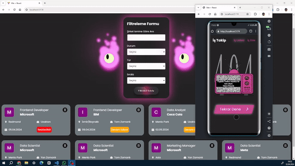

# React Toolkit ile İş ve Proje Takip Uygulaması
- Bu proje Redux Toolkit ile state yönetimini store kullanımını deneyimlemek için geliştirilmiştir.
- Projede  Kullanıcının başvurduğu  işleri ekleme silebilme ve listeleme ile  ve filtreleyebilme özelliğiyle Başvurulan işlerin takibin kolaylaştırlması hedeflenmiştir.

# Kullanılan Teknolojiler:

- **React Toolkit:** React uygulamalarını geliştirmek için tasarlanmış bir kütüphanedir. Bu kütüphane, React uygulamalarında state yönetimi ve veri işleme gibi işlevleri daha kolay ve verimli hale getirir.

- **React Router Dom:** React uygulamalarında sayfa yönlendirmesi ve yönetimi için kullanılır. Birden fazla sayfadan oluşan uygulamaları oluşturmak için idealdir.

- **Axios:** HTTP istekleri yapmak için kullanılan bir JavaScript kütüphanesidir. Genellikle React uygulamalarında API'lerle iletişim kurmak için tercih edilir.

- **JSON Server:** Basit bir RESTful API oluşturmak için kullanılır. Geliştirme aşamasında sahte bir API oluşturmak için sıklıkla tercih edilir.

- **React Toastify:** Kullanıcılar için bildirimler ve uyarılar göstermek için kullanılır. Başarılı veya başarısız işlemleri kullanıcıya bildirmek için kullanışlıdır.

- **React Redux Toolkit:** Redux'u kullanarak React uygulamalarında global state yönetimini kolaylaştıran bir kütüphanedir. Redux'un karmaşıklığını azaltır ve yaygın olarak kullanılan özellikleri sağlar.

- **UUID:** Benzersiz tanımlayıcılar oluşturmak için kullanılır. Özellikle veritabanında her bir öğenin benzersiz bir kimliğe sahip olması gerektiğinde kullanılır.

- **React Icons:** Projede kullanılacak ikonları temsil etmek için kullanılır. Kolayca erişilebilir ve çeşitli ikon kütüphanelerini destekler.

## Kullanılan Algoritmalar:

- **Filtreleme:** Listelenen öğeleri kullanıcı tarafından belirli kriterlere göre filtrelemek için kullanılan bir algoritmadır. Projede bir iş başvurusunu  eski tarihten yeniye ,yeni tarihten eski tarihe ,alfabetik sıraya , alfabetik sıranın tersine göre veya inputa girilen karakterlerle işleri filtrelemek gibi.

- **Debounce ile API İsteği:** Kullanıcı bir giriş alanına veri girerken, isteklerin çok hızlı bir şekilde gönderilmesini önlemek için debounce yöntemi kullanılabilir. Bu, kullanıcının yazmayı bitirdiğinde bir API isteğinin gönderilmesini sağlar ve gereksiz istek trafiğini azaltır.

- **Input Veri Önerisi :** Kullanıcıya giriş yaparken, mevcut veri kümesi içinden öneriler sunmak için kullanılır. Örneğin, bir iş takip projesinde şirket adını girdiğinde, daha önce kaydedilmiş şirket adlarının önerilmesi gibi.

## Ekran Görüntüsü

